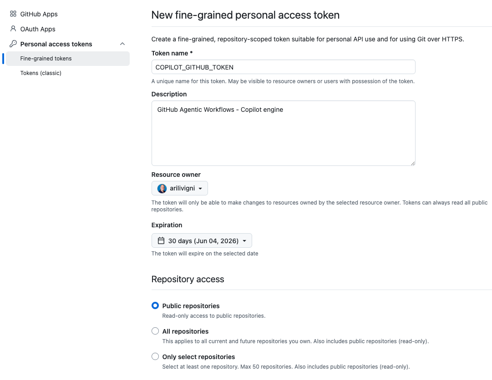
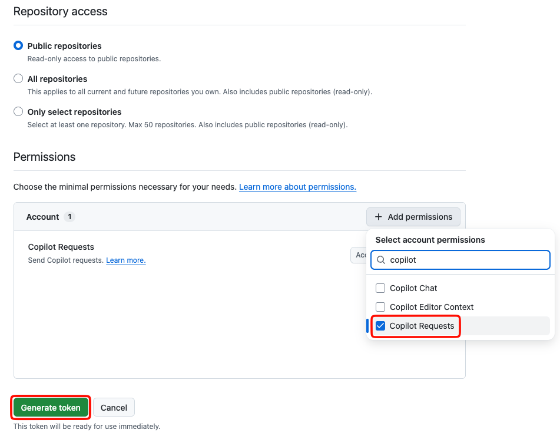
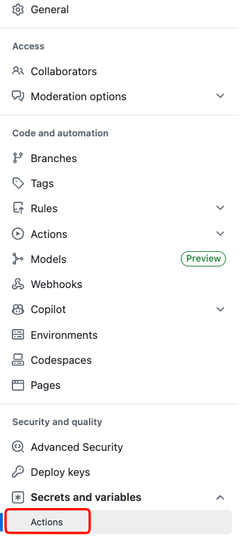
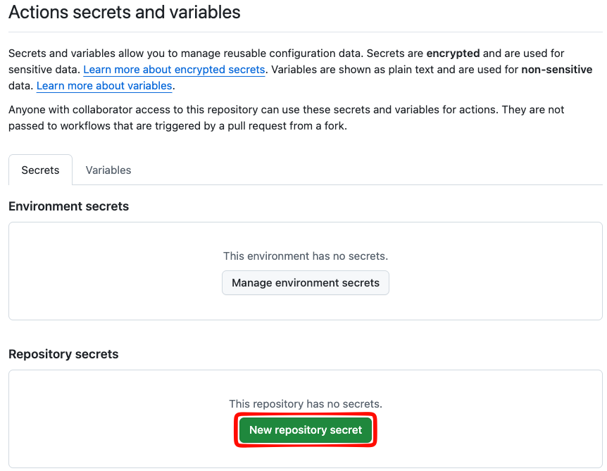
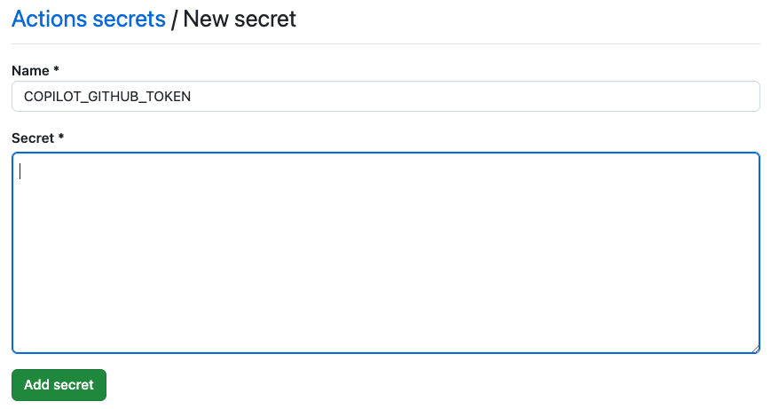
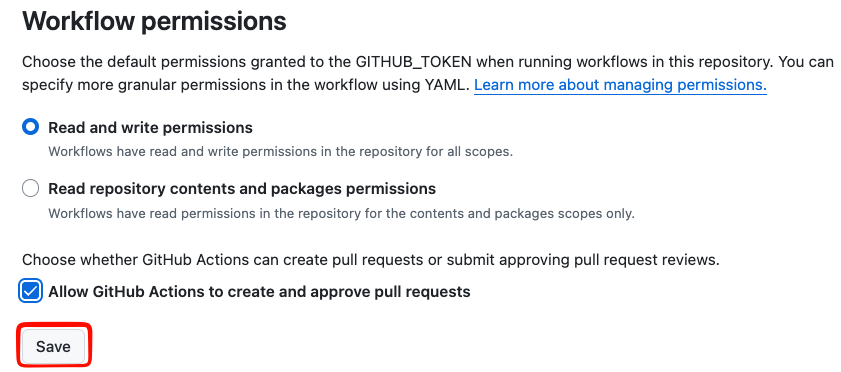

## Step 1: Initialize agentic workflows and merge the setup

Mona's website needs repository-level setup before an agentic workflow can help. In this step, you'll initialize GitHub agentic workflows setup and merge it to `main`.

### 📖 Theory: What are agentic workflows?

[**Agentic workflows**](https://github.github.com/gh-aw/introduction/overview/) are AI-powered automation that can understand repository context and take action from natural language instructions you write in markdown.

The `gh aw compile` command turns those markdown instructions into a hardened GitHub Actions workflow (`.lock.yml`). Workflows are read-only by default, and write operations go through controlled [`safe-outputs`](https://github.github.com/gh-aw/reference/safe-outputs/) such as creating issues, comments, and pull requests.

### 📖 Theory: Setting Up a Repository for agentic workflows

The [`gh aw init`](https://github.github.com/gh-aw/setup/cli/) command adds the setup files a repository needs for agentic workflows. In this exercise, you'll use it in Codespaces, review the setup pull request, and merge it to `main`.

### :keyboard: Activity: Set up your Codespace and agentic workflow tooling

Let's start in the pre-configured Codespace for this exercise. The dev container installs the website dependencies, the GitHub CLI, Copilot CLI, the GitHub Copilot extensions for VS Code, and opens a terminal in the editor. You'll install the agentic workflows CLI yourself in the first activity.

1. Use the button below to open the **Create Codespace** page in a new tab. Use the default configuration.

   [](https://codespaces.new/{{full_repo_name}}?quickstart=1)

2. Confirm the **Repository** field is your copy of the exercise, not the original template, then click the green **Create Codespace** button.
   - ✅ Your copy: `/{{full_repo_name}}`
   - ❌ Original: `/skills/agentic-workflows-that-read-the-room`

3. Wait for Visual Studio Code to load in your browser. The codespace setup may take a few minutes while it installs dependencies and verifies the Astro site build.

4. Try Mona's website locally. In the left sidebar, select **Run and Debug**, choose **Mona Astro: Dev Server**, and start the launch configuration.

   

   When the site starts, open the forwarded port `4321` in your browser and confirm the GitHub Info website loads.

5. In the terminal that opened in the editor, run the official standalone installer to install or update the GitHub agentic workflows CLI extension.

   > 
   >
   > ```bash
   > curl -fsSL https://raw.githubusercontent.com/github/gh-aw/main/install-gh-aw.sh | bash
   > ```

   This standalone installer is the easiest path in Codespaces because it does not depend on interactive `gh extension install` authentication.

6. Set up the `COPILOT_GITHUB_TOKEN` repository secret that the Copilot engine will use later in the exercise.

   1. [Create a fine-grained personal access token](https://github.com/settings/personal-access-tokens/new?name=COPILOT_GITHUB_TOKEN&description=GitHub+Agentic+Workflows+-+Copilot+engine+authentication&user_copilot_requests=read) with **Copilot Requests** set to **Read**.
      <details>
        <summary>Token permissions details</summary><br/>
        
        
      </details>
   2. Copy the token value.
   3. In your copied exercise repository, go to **Settings** > **Secrets and variables** > **Actions**.
   4. Select **New repository secret**.
   5. Name the secret `COPILOT_GITHUB_TOKEN`, paste the token value, and save it.
      <details>
        <summary>Repository Action secrets details</summary><br/>

        
        
        
      </details>

> [!CAUTION]
> Never paste a real token into a comment, markdown file, pull request, or Copilot Chat message. Only add it through the repository secrets UI.

7. Set the Actions workflow permissions to **Read and write permissions** so the agent can propose changes to the website content.

   1. In your copied exercise repository, go to **Settings** > **Actions** > **General**.
   2. Under **Workflow permissions**, select **Read and write permissions**.
   3. Check **Allow GitHub Actions to create and approve pull requests**.
   4. Save the changes.

   <details>
     <summary>Actions workflow permissions details</summary><br/>

     
  </details>

8. Initialize the repository with `gh aw` in the terminal.

   > 
   >
   > ```bash
   > gh aw init --create-pull-request --completions
   > ```

9. Review the pull request that was opened. It should include repository setup files such as:

   - `.github/workflows/copilot-setup-steps.yml`
   - `.github/agents/agentic-workflows.md`
   - `.github/mcp.json`
   - `.gitattributes`

10. Merge the setup pull request into `main`.

11. Wait about 20 seconds, then refresh the exercise issue for the next step.

<details>
<summary>Having trouble? 🤷</summary><br/>

- Make sure `gh aw init --create-pull-request --completions` ran from your copied exercise repository.
- The check looks for agentic workflows setup files created by `gh aw init`, including `.github/workflows/copilot-setup-steps.yml`, `.github/agents/agentic-workflows.md`, `.github/mcp.json`, and `.gitattributes`.
- Make sure `COPILOT_GITHUB_TOKEN` is a repository Actions secret, not a value committed to the repository.
- Step 1 only completes after your setup pull request is merged into `main`.

</details>
