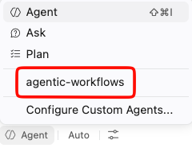

## Step 2: Create Mona's website updater workflow

Nice work getting the repository ready. Now it's time to build the first agentic workflow for Mona's website.

### 📖 Theory: Agentic workflows as repository teammates

An agentic workflow can read repository context, compare sources, draft changes, and open a pull request for human review. That makes it a great fit for Mona's website, where updates should be prepared automatically but still reviewed before they are published.

In this step, you'll create a workflow definition in `.github/workflows/` and pair it with a real content update in the website source. Your workflow should tell the agent to read Mona's notes, check the GitHub Blog and the GitHub Changelog, and then prepare a pull request for Mona to review.

### :keyboard: Activity: Create Mona's updater workflow

Continue working in VS Code. If you closed your browser editor, reopen your development environment from your repository's **Code** menu.

1. In the new  **terminal window**, use the keyboard shortcut `Ctrl + I` (Windows) or `Cmd + I` (Mac) to bring up **Copilot's Terminal Inline Chat**.

2. Ask Copilot to help create a branch, update a file, and publish the work.

   > 
   >
   > ```prompt
   > Hey copilot, 
   > - Make sure I am on the latest main branch
   > - Create a new branch named create-mona-updater
   > - Update site/content/github-info.md with a new section
   >   named "Latest GitHub Updates" and include at least
   >   one concise update for readers.
   > ```

   > 💡 **Tip:** If Copilot doesn't give you quite what you want, you can always continue explaining what you need. Copilot will remember the conversation history for follow-up responses.

3. Now let's use the agentic-workflows agent to create a workflow that opens pull requests with future website updates. Open the **Copilot Chat panel** using `Ctrl + Alt + I` (Windows) or `Ctrl + Cmd + I` (Mac). Select the **agentic-workflows** agent from the agent selector and give it access to edit files in the repository.

> [!NOTE]
> The agentic-workflows agent is a general-purpose agent that can follow instructions in markdown files.
> This will allow the agent to propose changes to the website content and create pull requests for review.

   

4. Before prompting the agent, add a rule to `.github/agents/agentic-workflows.md` so the agent knows not to compile workflows on its own. Open the file and add the following line under Important Notes:

   ```markdown
   When creating or editing agentic workflow files, do not compile them. Only create or update the markdown workflow file.
   ```

5. Ask the agentic-workflows agent to create the workflow file.

   > 
   >
   > ```prompt
   > - Create .github/workflows/update-github-info.md
   >   as an agentic workflow markdown file.
   > - Run the workflow on daily or on demand with workflow_dispatch.
   > - Give the workflow edit access through the tools configuration.
   > - Use safe-outputs with create-pull-request so the agent can
   >   propose changes without writing directly to main.
   > - Tell the agent to:
   >   - read notes/mona-notes.md,
   >   - web fetch https://github.blog/latest/
   >   - web fetch https://github.blog/changelog/
   > - update site/content/github-info.md, and open
   > - a pull request for Mona to review.
   > - Check the syntax of the configuration for the agentic workflow is valid
   > - Don't compile the workflow
   > ```

### :keyboard: Activity: Compile the `update-github-info.md` Agentic Workflow

1. Compile the agentic workflow file `.github/workflows/update-github-info.md` in the  **terminal window**.

   > 
   >
   > ```bash
   > gh aw compile .github/workflows/update-github-info.md
   > ```

2. Review Copilot's suggested changes. Make sure `site/content/github-info.md` includes `## Latest GitHub Updates`.

3. In `.github/workflows/update-github-info.md`, make sure Copilot clearly instructed the agent to:

   - read `notes/mona-notes.md`
   - use the GitHub Blog
   - use the GitHub Changelog
   - update `site/content/github-info.md`
   - create a pull request for Mona to review using `safe-outputs`

4. The workflow file should look similar to this:

   ```markdown
   ---
   name: update-github-info
   description: Draft website updates for Mona's GitHub Info site from official GitHub sources.
   on:
   workflow_dispatch:
   schedule:
      - cron: '17 9 * * *'
   safe-outputs:
   create-pull-request:
      title-prefix: "[mona] "
      draft: true
      fallback-as-issue: false
   tools:
   edit:
   web-fetch:
   network:
   allowed:
      - github.com
      - github.blog
   ---

   # Update Mona's GitHub Info website

   Read `notes/mona-notes.md` before making changes.

   Use these sources:
   - `notes/mona-notes.md`
   - GitHub Blog: https://github.blog/latest/
   - GitHub Changelog: https://github.blog/changelog/

   Update `site/content/github-info.md` with concise,
   practical updates for readers and include source context when content comes
   from the GitHub Blog or GitHub Changelog.

   Open a pull request for Mona to review. 
   Use a pull request title that mentions Mona or GitHub Info. 
   Do not write directly to `main`;
   rely on `safe-outputs` with `create-pull-request`.
   ```

5. In the new  **terminal window**, use the keyboard shortcut Ctrl + I (Windows) or Cmd + I (Mac) to bring up Copilot's Terminal Inline Chat.

   Ask Copilot to commit, push, and open a pull request.

   > 
   >
   > ```prompt
   > - Commit the website content and Agentic Workflow changes.
   > - Push the create-mona-updater branch.
   > - Open a pull request into main.
   > - Use the pull request title "Create Mona website updater workflow".
   > ```

6. Merge the pull request into `main`. Wait about 20 seconds, then refresh the exercise issue for the next step.

<details>
<summary>Having trouble? 🤷</summary><br/>

- The grading check looks for both a website content update and a new workflow file.
- Include the phrases `GitHub Blog`, `GitHub Changelog`, `safe-outputs`, `create-pull-request`, and `pull request` in `.github/workflows/update-github-info.md`.
- Keep your workflow in markdown (`.md`) so the exercise focuses on the agent instructions.

</details>
