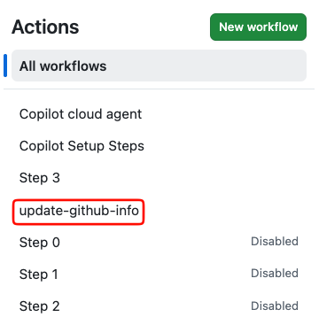
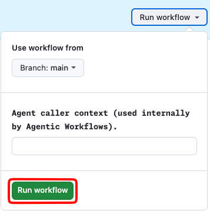
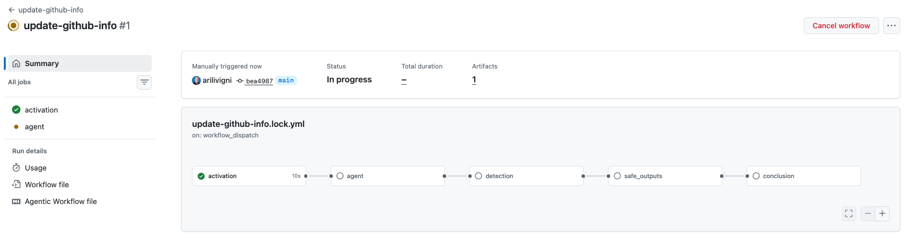
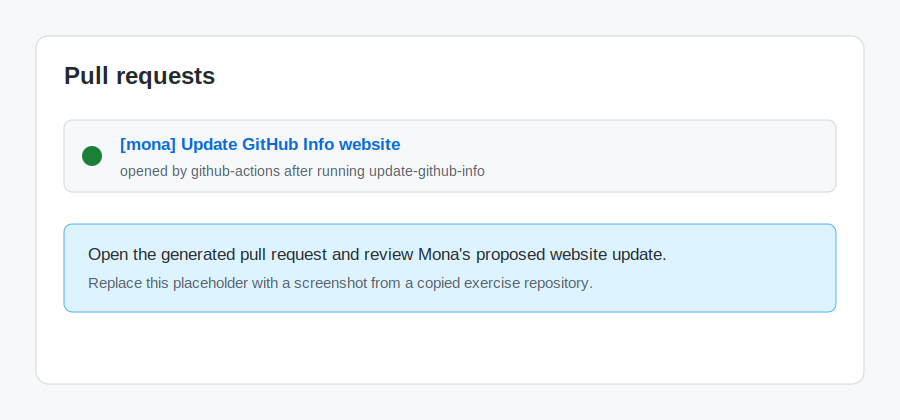

## Step 3: Run Mona's updater and review the generated pull request

You now have an agentic workflow definition for Mona's website. In this step, you'll run it and inspect the pull request it creates.

### 📖 Theory: From workflow definition to generated pull request

Agentic workflows are authored as markdown files, but GitHub Actions runs compiled `.lock.yml` workflow files. The `gh aw compile` command turns `.github/workflows/update-github-info.md` into `.github/workflows/update-github-info.lock.yml`.

Because this workflow uses the default Copilot engine, it needs the `COPILOT_GITHUB_TOKEN` Actions secret you added in Step 1 before the compiled workflow can run.

The workflow uses `safe-outputs: create-pull-request`, so the agent can draft website changes without writing directly to `main`. The agent prepares a patch, and a separate permission-controlled job opens a pull request for Mona to review.

### :keyboard: Activity: Run the updater and inspect its pull request

> [!IMPORTANT]
> Make sure you are still using branch `create-mona-updater` from Step 2. If you switched branches, return to `create-mona-updater` before continuing.

1. Confirm the repository still has the `COPILOT_GITHUB_TOKEN` Actions secret from Step 1.

   If you need to check, go to **Settings** > **Secrets and variables** > **Actions** in your copied exercise repository. You should see `COPILOT_GITHUB_TOKEN` listed as a repository secret.

2. Open the **Copilot Chat panel** using `Ctrl + Alt + I` (Windows) or `Ctrl + Cmd + I` (Mac). Select the **agentic-workflows** agent from the Copilot Chat agent selector to update Mona's updater `.github/workflows/update-github-info.md`.

   

   > 
   >
   > ```prompt
   > - Update .github/workflows/update-github-info.md workflow
   > - Tell agent to:
   >      web fetch https://awesome-copilot.github.com/workflows/
   > - Add to sources awesome-copilot workflows https://awesome-copilot.github.com/workflows/
   > ```

3. Compile the agentic workflow file `.github/workflows/update-github-info.md` in the  **terminal window**.

   > 
   >
   > ```bash
   > gh aw compile .github/workflows/update-github-info.md
   > ```

4. In the new  **terminal window**, use the keyboard shortcut Ctrl + I (Windows) or Cmd + I (Mac) to bring up Copilot's Terminal Inline Chat.

   Ask Copilot to commit, push, and open a pull request.

   > 
   >
   > ```prompt
   > - Commit the website content and Agentic Workflow changes.
   > - Push to the `create-mona-updater` branch
   > - Open a pull request into main.
   > - Use the pull request title "Update Mona website updater workflow".
   > ```

5. In the GitHub UI merge the pull request, then open the **Actions** tab, select the `update-github-info` workflow, and choose **Run workflow**.

   

   

   

6. Wait for the workflow to create a pull request for Mona's website update.

   

7. Open the generated pull request and review the **Files changed** tab. Confirm it updates `site/content/github-info.md` and mentions the source of the update.

   

8. Leave the generated pull request open. When the updater workflow finishes, Mona will look for an open pull request that updates `site/content/github-info.md`. Wait about 20 seconds, then refresh the exercise issue for the final review.

<details>
<summary>Having trouble? 🤷</summary><br/>

- If the workflow fails before the agent starts, confirm `COPILOT_GITHUB_TOKEN` is configured as an Actions secret.
- If compilation fails, make sure `.github/workflows/update-github-info.md` includes `safe-outputs`, `create-pull-request`, `workflow_dispatch`, and a `network` allowlist.
- If no pull request appears, open the failed workflow run from the **Actions** tab and review the logs.
- If the pull request opens as a draft, that is expected. Mona should review generated website changes before they merge.

</details>
