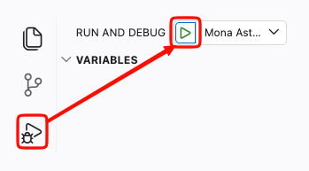

## Review

_Congratulations, you've completed **Agentic Workflows That Read the Room** and built your first hands-on GitHub agentic workflows practice scenario!_ 🎉

Pull the latest changes from `main` to get the final updates to the exercise repository, then review your work to see the changes on your website!🎉

 Need help to view your changes ? 

View Mona's website locally. In the left sidebar(if it's not running yet), select **Run and Debug**, choose **Mona Astro: Dev Server**, and start the launch configuration.

   

   When the site starts, open the forwarded port `4321` in your browser and confirm the GitHub Info website loads.

 

Here's what you accomplished:

- **Installed agentic workflow setup** — You added the repository workflow that prepares GitHub agentic workflows tooling.
- **Created a website updater** — You drafted a workflow for Mona's GitHub Info website that uses repository notes plus the GitHub Blog and GitHub Changelog, and compiles it to a `.lock.yml` workflow file.
- **Added a new source site to the workflow** — You updated the workflow to include the [awesome-copilot workflows](https://awesome-copilot.github.com/workflows/) site as a source for `.github/workflows/update-github-info.md` and recompiled it.
- **Ran the agentic workflow** — You compiled Mona's updater, ran it, and inspected the pull request it generated.

### What's next?

- **Try `gh aw init` and `gh aw add-wizard`** to explore more workflow setup patterns.
- **Create another content workflow** for release notes, issue triage, or changelog summaries.
- **Refine Mona's prompt** with stronger guardrails, output formatting, or review instructions.
- **Explore more docs** at the [GitHub Agentic Workflows site](https://github.github.com/gh-aw/).
